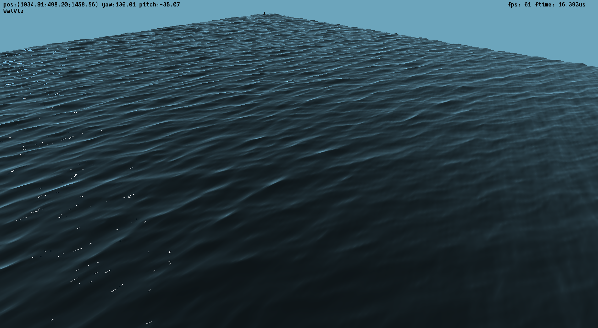
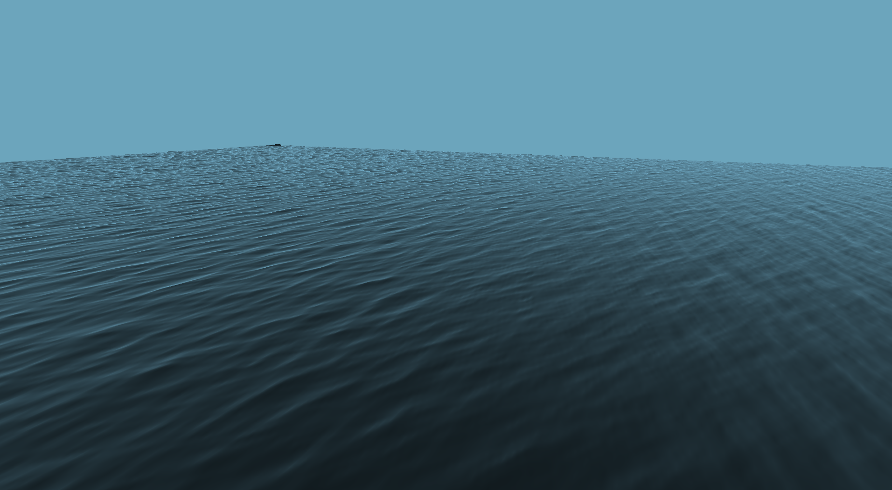

# Water surface visualization using OpenGL

This is the coursework for course "Algorithms of computer graphics".

## Usage

### Keymap

| key      | action                             |
|----------|------------------------------------|
| `WASD`   | Moving                             |
| `Space`  | Move up                            |
| `LShift` | Move down                          |
| `p`      | Hide/show cursor                   |
| `q`      | Change display mode: mesh/polygons |
| `z`      | Freeze geometry                    |
| `i`      | Take screenshot                    |

## Screenshots

