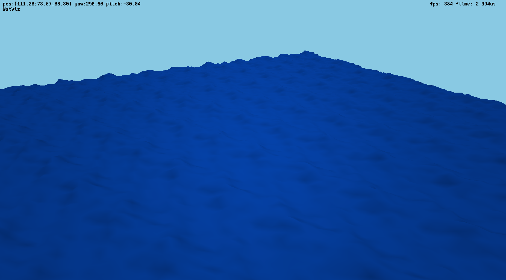
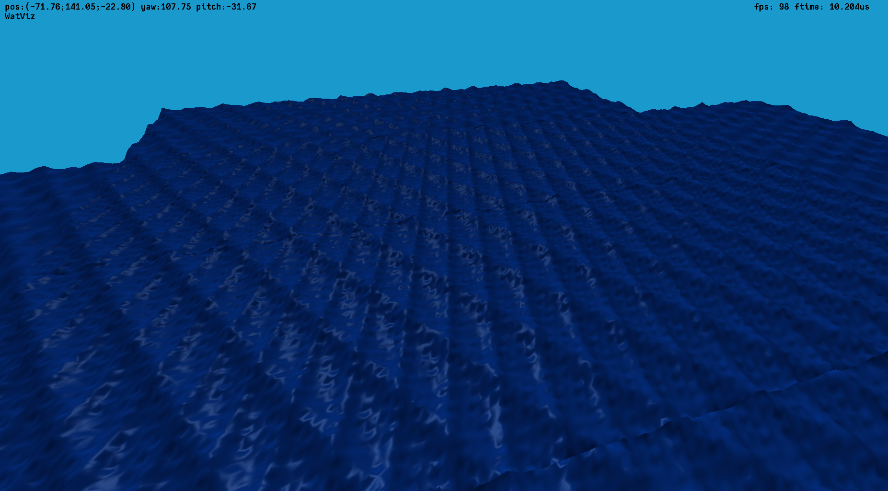

# Water surface visualization using OpenGL

This is the coursework for course "Algorithms of computer graphics".

## Usage

### Keymap

| key   | action                             |
|-------|------------------------------------|
| `Esc` | Open menu                          |
| `p`   | Hide/show cursor                   |
| `q`   | Change display mode: mesh/polygons |
| `z`   | Freeze geometry                    |
| `i`   | Take screenshot                    |

## Screenshots

### Sums of sinuses

### Wrong way but cute

